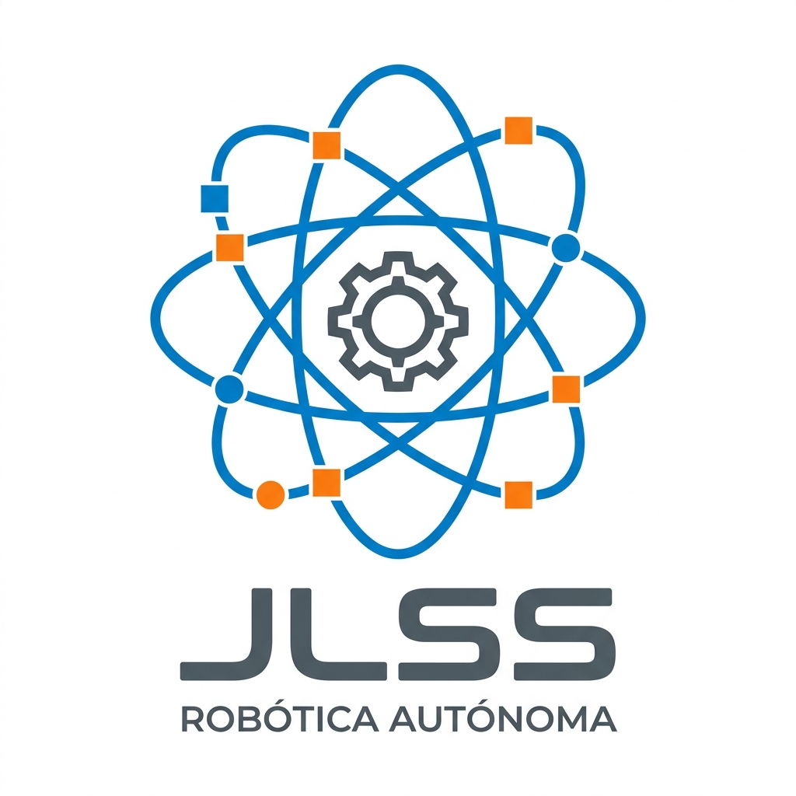

# 🏎️ WRO 2026 Future Engineers – Team JLSS

<div align="center">
  

  [](https://www.instagram.com/TU_INSTAGRAM/)
  [](https://www.instagram.com/alphastudentacademy/)
</div>

---

## 🏆 **REPRESENTANDO A ALPHA STUDENT ACADEMY – RUMBO A WRO 2026**

Bienvenidos al repositorio oficial del **Team JLSS**, compitiendo en la categoría **Future Engineers** de la **World Robot Olympiad™ (WRO)**. Somos un equipo de **Alpha Student Academy**, Venezuela, conformado por futuros ingenieros dedicados al desarrollo de movilidad autónoma inteligente.

Nuestra filosofía combina el rigor académico de la **Ingeniería Electrónica** con la innovación práctica. El objetivo es diseñar el vehículo más eficiente y preciso, optimizando cada milímetro de hardware y cada línea de código para dominar los retos de navegación y detección de obstáculos.

> 💡 **Estado del Proyecto:** Desarrollo activo de hardware y optimización de algoritmos de control PID y visión artificial.

---

## 📚 **Tabla de Contenidos**
- [📂 Estructura de Documentación](#-estructura-de-documentación)
- [👥 El Equipo](#-el-equipo)
- [🛠️ Stack Tecnológico](#-stack-tecnológico)
- [🔧 Sistema Electrónico](#-sistema-electrónico)
- [🚀 Instalación y Uso](#-instalación-y-uso)

---

## 📂 **Estructura de Documentación**

<div align="center">

| 📁 Carpeta | 🎯 Contenido Técnico | 📖 Link |
|-----------|----------------------|-----------|
| **📂 planes** | **Hardware & Componentes**<br>• Fichas técnicas detalladas<br>• Inventario de componentes | [🔗 Ver Documentación](./planes/README.md) |
| **💻 src** | **Firmware & Algoritmos**<br>• Lógica de navegación (C++)<br>• Controladores de sensores | [🔗 Próximamente](#) |
| **⚙️ models** | **Diseño Mecánico**<br>• Modelos CAD 3D del chasis | [🔗 Próximamente](#) |

</div>

---

## 👥 **El Equipo** <a id="the-team"></a>

Un equipo interdisciplinario, donde todos los miembros comparten la formación de educación superior en **Ingeniería Electrónica (Mención Automatización y Control)**.

### **Members**

* **Jose Montiel (Team Leader)**
    * **Background:** Estudiante de Ing. Electrónica (Automatización y Control) | Instructor de Robótica.
    * **Role:** *Software Architecture & Vision Strategy*.
    * **Focus:** Firmware en C++, control PID de velocidad y procesamiento de visión artificial.

* **Santiago Barreto**
    * **Background:** Estudiante de Ing. Electrónica (Automatización y Control).
    * **Role:** *Mechanical Engineering & CAD Design*.
    * **Focus:** Diseño del chasis 3D, cinemática de dirección y optimización estructural.

* **Leomar Gómez**
    * **Background:** Estudiante de Ing. Electrónica (Automatización y Control).
    * **Role:** *Hardware Integration & Power Systems*.
    * **Focus:** Regulación de energía, gestión de baterías 18650 e integridad de señales.

### **Coach**

* **Sebastian Gil**
    * **Role:** *Team Mentor & Strategic Coordinator*.
    * **Background:** Instructor en **Alpha Student Academy**.
    * **Focus:** Dirección estratégica y cumplimiento de estándares de ingeniería internacionales.

---

## 🛠️ **Stack Tecnológico**

* **Cerebro:** ESP32-S3 con aceleración para procesamiento de señales.
* **Percepción:** Sensor de visión Huskylens 2 y red de sensores láser VL53L0X (ToF).
* **Control de Estabilidad:** IMU BNO086 de 9 ejes para seguimiento de rumbo.
* **Actuadores:** Motores N20 con encoders de alta resolución y servos MG996R.

---

## 🔧 **Sistema Electrónico (Componentes Principales)**

| Componente | Vista Previa | Función Crítica |
|-----------|:-----------:|-------------------|
| **ESP32-S3** |  | Procesamiento central. |
| **Huskylens 2** |  | Visión y detección. |
| **VL53L0X** |  | Telemetría láser. |
| **N20 Encoder** |  | Control de tracción. |

---

## 🚀 **Instalación y Uso**

```bash
# Clonar el repositorio oficial
git clone [https://github.com/Vikchou28/WRO2026-FE-TEAM-JLSS.git](https://github.com/Vikchou28/WRO2026-FE-TEAM-JLSS.git)

# Acceder a la documentación de hardware
cd planes
